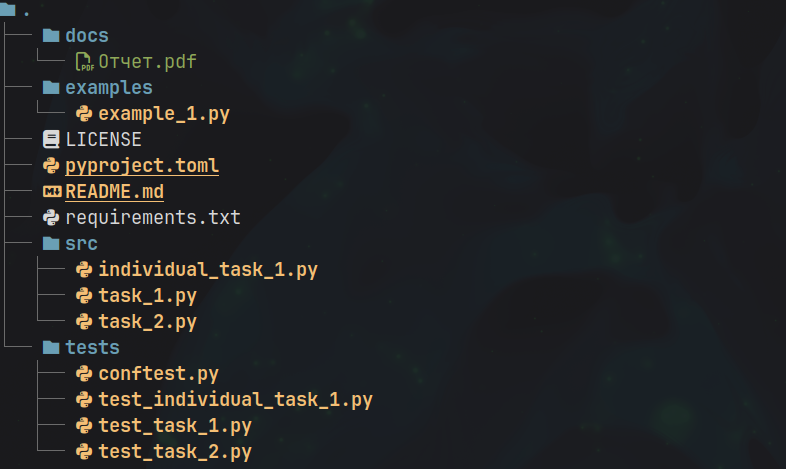

# Лабораторная работа №5 (4.4)
**Предмет** Объектно-ориентированное программирование  
**Тема:** Работа с исключениями в языке Python  
**Вариант:** 8  

## Содержание

1. [Описание работы](#цель-работы)  
2. [Ссылка на отчет](#ссылка-на-отчет)  
3. [Структура репозитория](#структура-репозитория)  
4. [Задания](#задания)  

---

## Цель работы

Приобретение навыков по работе с исключениями при написании программ с помощью языка программирования Python версии 3.x.

---

## Ссылка на отчет

[Отчет о выполнении лабораторной работы](docs/Отчет.pdf)

---

## Структура репозитория

- `docs/` — отчет по лабораторной работе
- `examples/` — примеры из лабораторной работы  
- `src/` — исходный код программы
- `tests/` — pytests
- `pyproject.toml` - конфигурация проекта
- `requirements.txt` — список зависимостей

---

## Задания

### Задание №1
[Исходный код задания](src/task_1.py)

Решите задачу:
Напишите программу, которая запрашивает ввод двух значений.

### Задание №2
[Исходный код задания](src/task_2.py)

Решите задачу:
Напишите программу, которая будет генерировать матрицу из случайных чисел. Пользователь может указать число строк и столбцов, а также диапазон чисел. Произведите обработку ошибок ввода пользователя. 

### Индивидуальное задание №2
[Исходный код задания](src/individual_task_1.py)

Выполните индивидуальное задание №1 лабораторной работы 2.19, добавив возможность работы с исключением и логированием.
